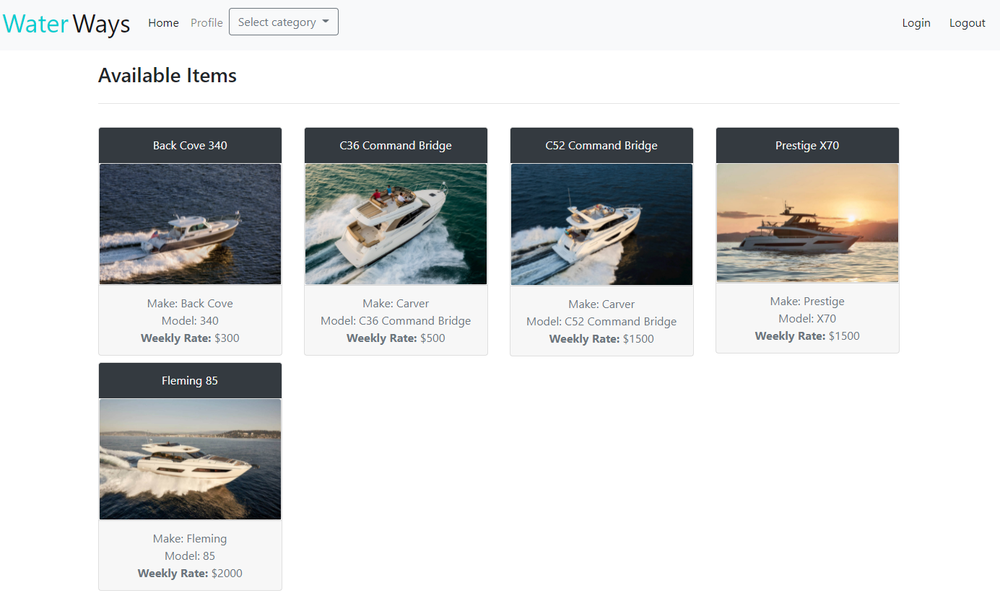
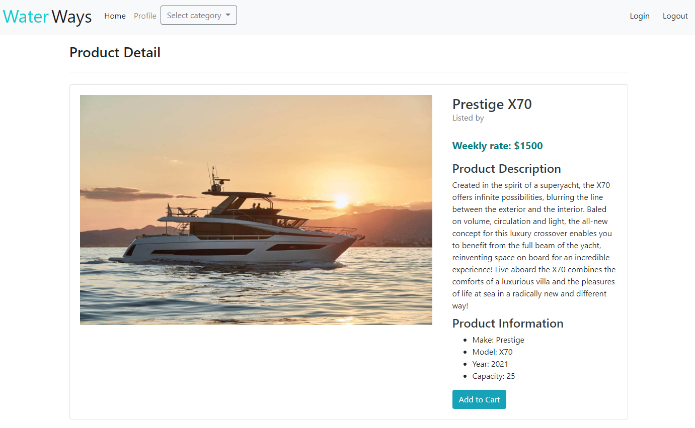

# Water Ways
  
  

  ## Description 
  Water Ways is an online marketplace that connects people who want to rent out thier boats or pesonal watercraft with people hwo are looking for the perfect boat for their next adventure.

  ### Owners
  For owners, partnering with Water Ways is a way to earn an income from property that they already have and may be laying about, unused.
  ### Renters
  For those who enjoy spending time on the water, but and are looking for options that don't include a large investment. With a large selection of watercraft in multiple categories, Water Ways provides a low-cost option for you to find the perfect boat for your next adventure.

  ## Table of Contents
  * [Links](#links)
  * [Techonologies](#techonologies)
  * [Installation](#installation)
  * [Usage](#usage)
  * [Contributors](#contributors)
  * [Questions](#questions)
  * [License](#license)
  
  ## Links
  Production Site: [`waterwaysrentals.herokuapp.com`](https://waterwaysrentals.herokuapp.com/) 
  GitHub Repo: [`justpuzey/water-sports-xchange`](https://github.com/justpuzey/water-sports-xchange/)
  
  ## Techonologies
  Water Ways uses Model-View-Controller web application framework to control data, routes, and render the UI

  * Express - Web framework used for managing routes
  * Sequelize - Utilizes models to manage MySQL data structures
  * Handlebars - Leverages templates to generate front-end views
  * Stripe - The site relies on Stripe for cart/checkout functions including payment processing and PCI data storage
  * express session - middleware used to assits in user session managment
  * bcrypt - Used for user password hashing
  
  ## Installation
  
<i>Steps required to install application, dependencies and configure the environment:</i>

  1. Navigate to the root folder
  2. Create dotenv folder to store DB Name, User Name, and Password for MySQL database as well as the non-public key for Stripe
  3. Use the command prompt to enter command: `npm install` to install dependencies

  ## Usage
  
<i>Instructions for application usage including examples:</i>

  Home Page

  

  Product List Page

  

  Product Detail Page

  
  

  ## Contributors
  
<i>Project Contributors/Authors:</i>

  * Justin Puzey
  * Christina Pagan
  * Andres
  * Candice Whiskey

  ## License
  The MIT License
  
  